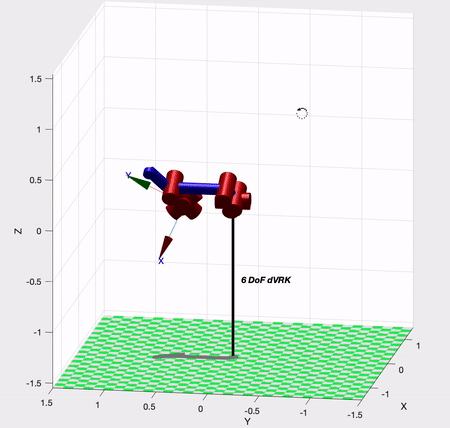
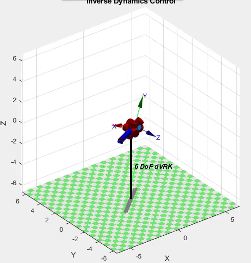
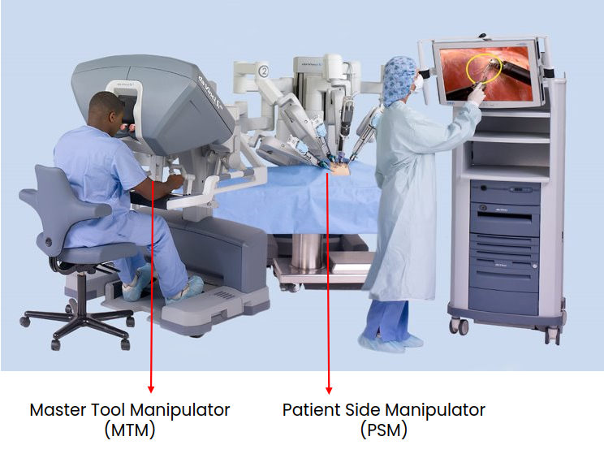
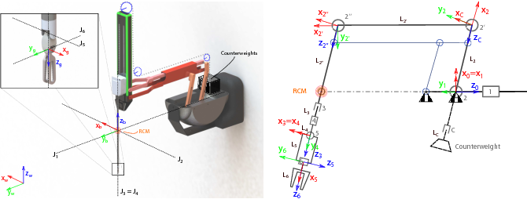
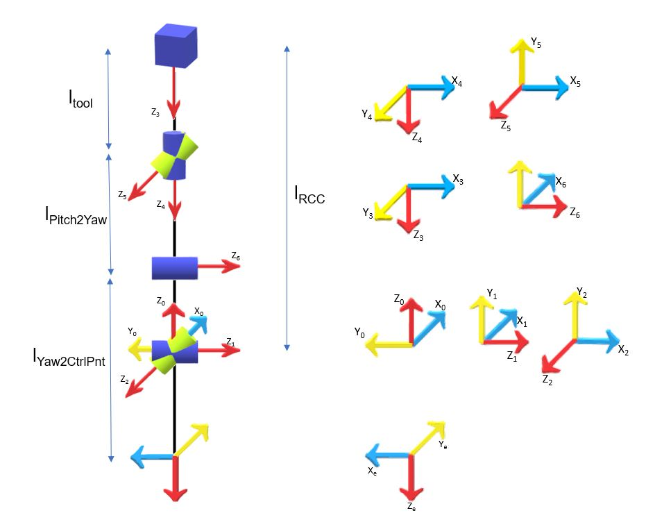

# dVRK PSM - Kinematics & Dynamics

## Demo 1 - Position Control of a single PSM in AMBF simulator
<figure>
    
    <figcaption><i>The PSM tracking a circle trajectory using position controller</i></figcaption>
</figure>

> :information_source: In the above video, the PSM is moving along a predefined trajectory using the position controller. The desired positions for the predefined trajectory is generated by computing the Inverse Kinematics on MATLAB using the Damped-Least-Squares method. The model of the PSM (i.e. the DH parameters) were obtained from the AMBF simulator and loaded on MATLAB using the Peter Coorke's Robotics Toolbox. The desired joint positions were exported from MATLAB to a CSV file. Thereafter, those joint values were parsed in the python script and sent to the AMBF simulator. The communication between them is taking place using ROS. <br> <br>


---
## Demo 2 - Position Control of a single PSM in MATLAB
<figure>
    
    <figcaption><i>The PSM tracking a circle trajectory using position controller</i></figcaption>
</figure>

> :information_source: In the above video, the PSM is moving along a predefined trajectory using the position controller. The desired positions for the predefined trajectory is generated by computing the Inverse Kinematics on MATLAB using the Damped-Least-Squares method. The model of the PSM (i.e. the DH parameters) were obtained from the AMBF simulator and loaded on MATLAB using the Peter Coorke's Robotics Toolbox. <br> <br>


---
## Demo 3 - Torque Control of a single PSM in MATLAB
<figure>
    
    <figcaption><i>The PSM tracking a circle trajectory using torque controller</i></figcaption>
</figure>

> :information_source: In the above video, the PSM is moving along a predefined trajectory using the effort controller. The desired positions for the predefined trajectory is generated by computing the Inverse Dynamics on MATLAB using the recursive Newton-Euler algorithm. The model of the PSM (i.e. the DH parameters) were obtained from the AMBF simulator and loaded on MATLAB using the Peter Coorke's Robotics Toolbox. <br> <br>


---
## Overview
#### Introduction
This project is based on the da Vinci Reasearch Kit (dVRK), an open-source surgical robotic platform. The aim of this project is to derive the complete dynamic model for the Patient Side Manipulator (PSM) of the dVRK and then calculate the inverse dynamics of the system to move it from a given start pose to a goal pose. Further, to verify the dynamic model and the calculated inverse dynamics, our model was used to simulate the PSM on the Asynchronous Multi-Body Framework (AMBF), developed by the AIM lab at WPI.

<figure>
    
</figure>

> fig1: The daVinci Research Kit (dVRK)		<br>

<br>
The schematic of the PSM and simplified model used for assigning the joint frames and link frames for carrying out our analysis is shown below:

<p float="left">
  
   
</p>

> fig1: The Patient Side Manipulator (PSM) 	<br>
> fig2: The schematic of the PSM 			<br>
> fig3: The simplified model of the PSM	 	<br> 


#### Contributions
This is a group project done for the course, "RBE501 - Robot Dynamics" at WPI. The team was comprised of 4 people and our contributions are described below:
- Emmanuel Jayaraju	: formal analysis, matlab development, python script development
- Aditya Mehrotra	: formal analysis, matlab development, inertia generation on blender
- Ritwik Pandey		: formal analysis, matlab development
- Haoying Zhou		: formal analysis, matlab development, python script development, conceptualization


<br><br>
---
## Scripts 

1. Python

`psm_ambf.py` : Code for simplified model, having inverse kinematics control.

`psm_full.py` : Code for full model, having inverse kinematics control.

2. MATLAB

`dVRK_FKIK_ambf.m` : Code for calculating inverse kinematics of simplified model, generate a csv file recording the joint variables and path coordinates.

`dVRK_FKIK_full.m` : Code for calculating inverse kinematics of full model, generate a csv file recording the joint variables and path coordinates.

`ModelDynamics.m`  : Code for calculating inverse dynamics of simplified model, generate a csv file recording the joint variables and path coordinates.


<br><br>
---
## Usage

* **STEP 1**: Clone this repository along with the submodules
	
	```bash
	$ git clone --recursive https://github.com/emmanuel-logy/daVinci_robot_controller.git
	```

* **STEP 2**: Please follow the steps in ambf submodule to build the AMBF simulator

* **STEP 3**: Start the AMBF simulator

	- For Simplified Model
	```bash
	$ cd <ambf_build_path>/bin/<your OS>
	$ ./ambf_simulator -a <this_repository_path>/models/psm1_verticle/psm_model.yaml
	```
	
	- For Full Model
	```bash
	$ cd <ambf_build_path>/bin/<your OS>
	$ ./ambf_simulator -a <this_repository_path>/models/psm_full/default.yaml
	```
	
* **STEP 4**: Control the PSM in AMBF simulator

	- For Simplified Model
	```bash
	$ cd <this_repository_path>/scripts
	$ python3 psm_ambf.py
	```
	
	- For Full Model
	```bash
	$ cd <this_repository_path>/scripts
	$ python3 psm_full.py
	```
<br><br>
	
	
	
	
	
	
---
## Future Work 

It is our plan to port all our work from MATLAB to C++ to perform torque control of the PSM on AMBF simulator. We plan to remove the dependency on MATLAB for dynamics computations and use the **Rigid Body Dynamics Library (RBDL)** C++ open source library to compute the dynamics. The link for this library is [https://github.com/ORB-HD/rbdl-orb](https://github.com/ORB-HD/rbdl-orb). 


---
## Reference

For more information regarding this work, please refer to the report named, "FinalReport.pdf" in the media folder.


---


